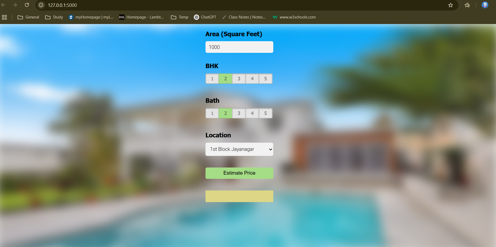
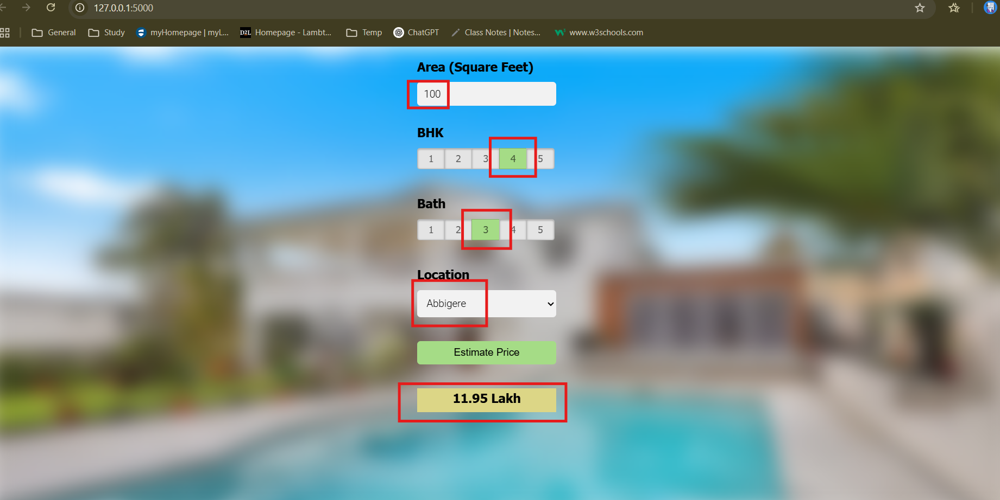

# 🏠 Bengaluru House Price Prediction App (ML Project)

A machine learning web application to estimate real estate prices in Bengaluru based on location, square footage, BHK, and bathroom count — trained and deployed on AWS EC2.

---

## 🚀 Features

- Trained a Linear Regression model on cleaned Kaggle housing data
- Flask-based REST API backend
- Interactive frontend with HTML, CSS, and JavaScript
- Deployed on AWS EC2 with NGINX

---

## 📁 Project Structure

BengaluruHousePriceApp/
├── model/ # Saved ML model and feature columns
├── static/ # CSS styles and frontend JavaScript
├── templates/ # HTML UI
├── app.py # Flask server code
├── notebooks/ # Jupyter notebook for model training
├── requirements.txt # Project dependencies
└── README.md # You're reading it!

---

## 📊 Model & Tech Stack

- **Model**: Linear Regression
- **Libraries**: Pandas, NumPy, Scikit-learn
- **Frontend**: HTML, CSS, JavaScript
- **Backend**: Flask (Python)
- **Deployment**: AWS EC2 with NGINX

---

## 🧠 ML Training Details

- **Algorithm**: Linear Regression
- **Dataset**: [Kaggle - Bengaluru House Data](https://www.kaggle.com/datasets/amitabhajoy/bengaluru-house-price-data)

---

## 🌍 Deployment

- Hosted on AWS EC2
- NGINX used to reverse proxy requests to Flask server
- Live Demo (when server is running):  
  🌐 http://ec2-18-222-20-156.us-east-2.compute.amazonaws.com/

---

## 💻 How to Run Locally

```bash
# 1. Clone this repository
git clone https://github.com/hetvis-pro/bengaluru-house-price-app.git
cd BengaluruHousePriceApp

# 2. Install required dependencies
pip install -r requirements.txt

# 3. Run the Flask app
python app.py

# 4. Open your browser and go to:
http://127.0.0.1:5000/

```

📷 UI screenshots 
1)App UI:

2)Output predictions:


<!-- 3)EC2 deployment running: -->

🙋‍♀️ Author
Hetvi
📧 hetvis.pro@gmail.com
🔗 https://www.linkedin.com/in/hetvi-sodha-pro/
